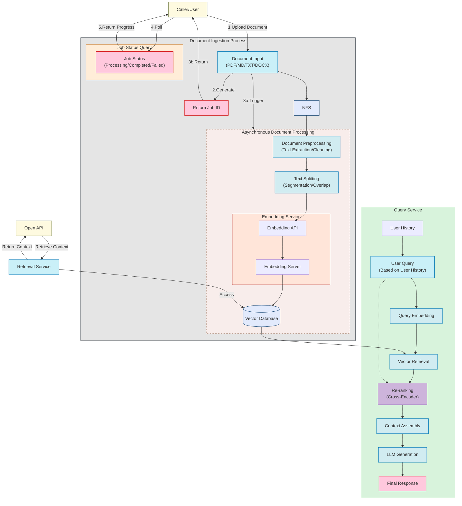
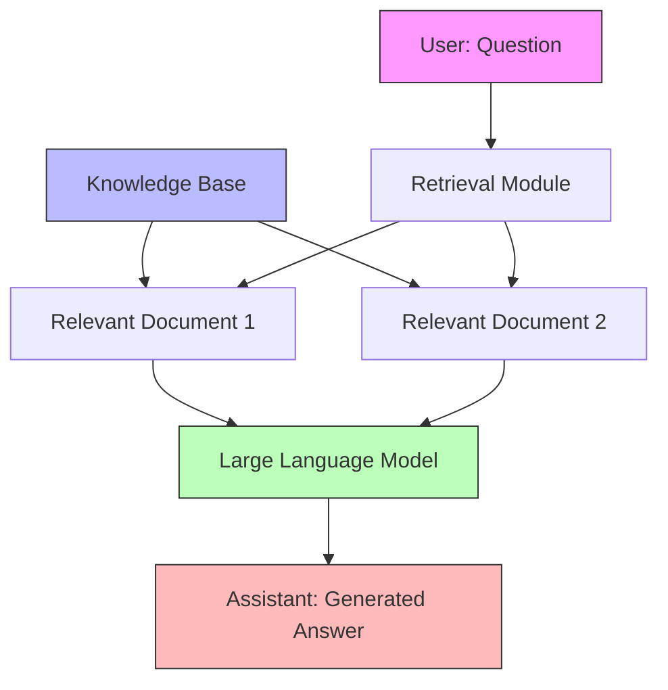
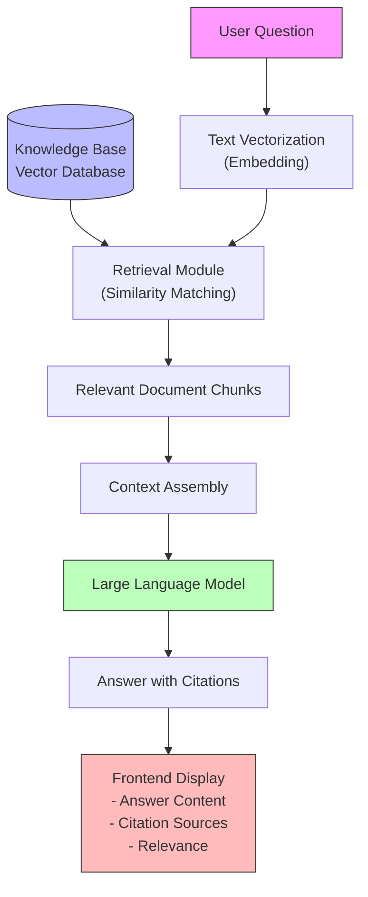
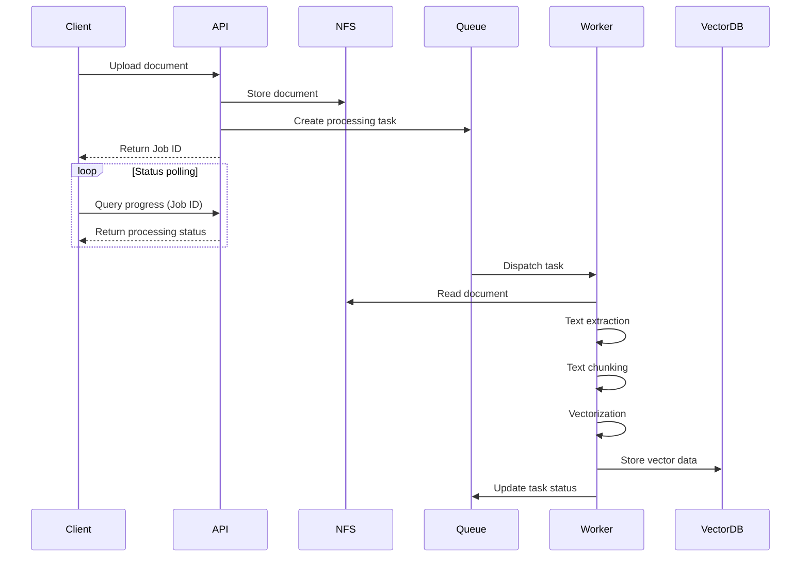
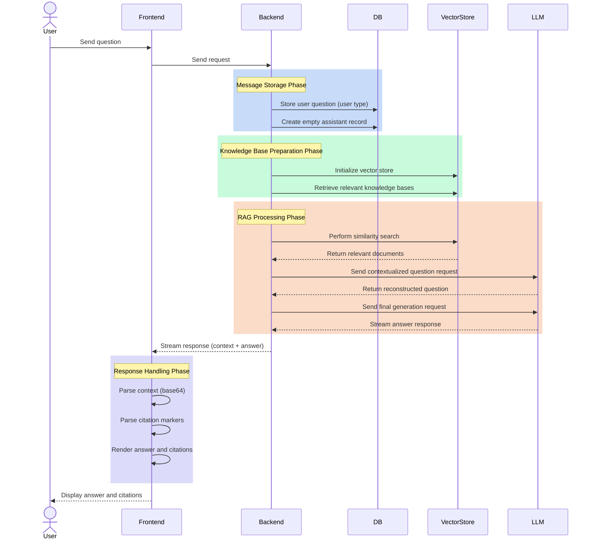
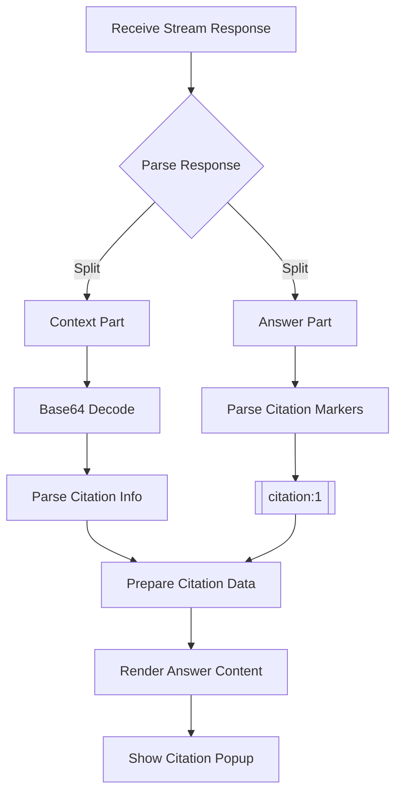

# Zero to Hero: How to Build a Knowledge Base QA System with RAG (Retrieval-Augmented Generation)

## Preface

As this year is coming to an end, this project was initiated in January 2025 as a leisure-time educational endeavor.

The main goal is to help more people understand and get started with RAG and knowledge bases, by leveraging existing tools and my experience from multiple RAG projects, without relying on large-scale infrastructure.

Therefore, in this project, you won't see many advanced RAG features yet, such as multi-retrieval, HyDE, or query rewriting (of course, I see some talented community members are already working on implementing these features).

Project flowchart:



## 1. Understanding RAG: Why "Retrieval + Generation"?

### 1.1 What is RAG

RAG stands for Retrieval-Augmented Generation. It is a technique that combines retrieval systems with generative AI models, consisting of two core steps:

1. Retrieval: Based on the user's question, relevant documents or information snippets are retrieved from a knowledge base.
2. Generation: The retrieved information is provided as context, and a large language model generates an accurate answer based on both the context and the user's question.

This approach allows the model to answer questions using up-to-date knowledge and provides traceable references, effectively addressing the issues of knowledge staleness and factual accuracy in large language models.

The following diagram illustrates the workflow of RAG in a conversational scenario:



### 1.2 Why Do We Need RAG

Let's compare the pros and cons of three QA approaches to understand why RAG is a better choice:

1. Traditional Retrieval QA
   - ✅ High reliability: Answers come directly from the knowledge base with clear sources
   - ✅ Knowledge is updatable: Add new documents to update knowledge
   - ❌ Low flexibility: Can only return content already in the knowledge base
   - ❌ Rigid expression: Hard to organize answers in natural language

2. Pure LLM QA
   - ✅ Natural expression: Answers are fluent and well-organized
   - ✅ Flexible understanding: Can comprehend various ways of asking questions
   - ❌ Knowledge is static: Limited to training data, cannot be updated in real time
   - ❌ Low reliability: Prone to hallucinations, hard to verify accuracy

3. RAG Approach
   - ✅ Reliable and traceable: Answers are based on retrieved documents
   - ✅ Knowledge is updatable: New knowledge can be continuously added
   - ✅ Natural expression: Leverages LLM's language capabilities
   - ✅ Flexible understanding: Can handle various question forms
   - ✅ Cost-effective: Main cost is necessary API calls

By combining retrieval and generation, RAG retains the reliability of traditional retrieval QA and gains the flexibility and natural expression of LLMs. It enables AI to always answer based on the latest, trustworthy knowledge while keeping the conversation smooth and natural.

Typical RAG application scenarios:

- Enterprise knowledge base QA: For internal employee knowledge or external customer support.
- Legal, academic, or reference scenarios: Where authoritative sources or evidence are required.
- Any scenario needing "answers with citation information".

## 2. RAG System Architecture and Data Flow

### 2.1 Core Components

- Vector Database: Stores vectorized document chunks (e.g., ChromaDB, Qdrant).
- Embedding (Text Vectorization): Converts text into comparable numerical vectors, e.g., [0.1, 0.2, 0.3, 0.4, 0.5].
- Retrieval: Finds the most relevant document chunks based on vector similarity to the user's query.
- Large Language Model: Combines the retrieved context with the user's question to generate the final answer.
- Generation & Citation: Embeds citation links or markers in the answer for traceability.

### 2.2 Typical RAG Workflow

1) User submits a question.
2) The question is vectorized, and the most similar document chunks are retrieved.
3) The retrieved context and the question are concatenated and sent to the LLM.
4) The LLM outputs an answer with citation information.
5) The frontend renders the answer, optionally displaying citation details in the UI.

The following diagram shows the interaction between each component:



## 3. Building a Knowledge Base: Document Processing, Embedding, and Storage

### 3.1 Document Upload and Chunking

#### 3.1.1 Why Chunk Documents?

Chunking is a key step in RAG systems for several reasons:

1. Precision of Vector Similarity Calculation

  - Long texts lead to less precise vector representations
  - Smaller chunks better capture local semantics
  - Improves retrieval accuracy

2. LLM Context Window Limitations

  - LLMs have limited input length (even though models like Qwen now support up to 1M tokens)
  - Documents need to be split into manageable sizes for LLMs
  - Prevents information loss due to token limits

3. Retrieval Efficiency and Cost

  - Smaller chunks allow for fine-grained indexing
  - Only the most relevant chunks are retrieved, saving tokens
  - Reduces irrelevant information and improves answer quality

4. Citation and Traceability (a unique feature of RAG)

  - Makes it easier to locate the exact source of information
  - Enables more precise citation ranges
  - Helps users verify the reliability of answers

#### 3.1.2 Common Chunking Strategies

1. Fixed-Length Chunking

  - Split by character or token count
  - Simple to implement, but may break semantic units
  - Suitable for uniformly structured documents

2. Semantic Chunking

  - Split by natural semantic units like paragraphs or sections
  - Maintains contextual coherence
  - Requires consideration of document structure

3. Overlapping Chunking

  - Adjacent chunks retain some overlap
  - Prevents key information from being split
  - Increases storage and computation overhead

4. Recursive Chunking

  - Start with large chunks, then subdivide
  - Maintains hierarchical structure
  - Suitable for processing long documents

Choosing the right chunking strategy depends on:

- Document type and structure
- Vector database characteristics
- LLM context window size
- Balancing retrieval efficiency and cost

For example, markdown files can be chunked by paragraph, while general documents can be chunked by section.

```text
+--------------------------------------------------+
|  # Chapter 1 Title                               |
|  Main content...                                 |
|  Main content...                                 |
|                                                  |
|  ## 1.1 Section Title                            |
|  - List item 1                                   |
|  - List item 2                                   |
|                                                  |
|  ### 1.1.1 Subsection Title                      |
|  Main paragraph...                               |
|                                                  |
|  # Chapter 2 Title                               |
|  Another paragraph...                            |
+--------------------------------------------------+
                    |
                    v
                  Chunking
                    |
                    v
+------------------+  +-------------------+  +------------------+
| Chunk 1:         |  | Chunk 2:          |  | Chunk 3:         |
| # Chapter 1      |  | ## 1.1 Section    |  | # Chapter 2      |
| Title            |  | Title             |  | Title            |
| Main content...  |  | - List item 1     |  | Another          |
| Main content...  |  | - List item 2     |  | paragraph...     |
+------------------+  |                   |  +------------------+
               | ### 1.1.1         |
               | Subsection Title  |
               | Main paragraph... |
               +-------------------+

```

### 3.2 Text Embedding

Text embedding is the process of converting natural language text into numerical vectors in a high-dimensional space. This transformation enables us to:

- Calculate semantic similarity between texts using mathematical methods
- Perform efficient similarity search in vector space
- Preserve semantic information and contextual relationships of the text

Common text embedding models include:

1. OpenAI Embeddings

  - text-embedding-ada-002 model
  - 1536-dimensional vector output
  - Suitable for English and multiple languages
  - Strong semantic representation capability

2. Sentence Transformers

  - Open-source sentence-level encoders
  - Support multiple languages
  - Can be fine-tuned for specific scenarios
  - High computational efficiency

In RAG Web UI, the main model used is OpenAI's text-embedding-ada-002.

```python
from langchain_openai import OpenAIEmbeddings
...

embeddings = OpenAIEmbeddings(
   openai_api_key=settings.OPENAI_API_KEY,
   openai_api_base=settings.OPENAI_API_BASE
)
```

### 3.3 Vector Database

After text embedding, the vectors need to be stored in a vector database for subsequent retrieval and similarity calculation.

In RAG Web UI, ChromaDB is mainly used as the vector database. At the same time, the Factory pattern is supported, allowing multiple vector databases, such as:

1. ChromaDB
2. Qdrant
3. Milvus
4. Faiss
5. Annoy
6. Pinecone
7. Zilliz

In addition to storing vectors, the vector database should also carry some metadata (such as document source, paragraph position, etc.) for easy reference. Typically, we store data structures like this in the vector database:

Besides the vector itself, we also need to store some metadata, for example:

```python
{
   "id": "chunk_id",
   "text": "Paragraph content",
   "metadata": {"source": "Document source", "position": "Paragraph position", "hash": "Paragraph hash"}
}
```

## 4. Retrieval and Re-ranking: Feeding the Most Relevant Context to the LLM

### 4.1 Similarity Search

Common similarity metrics: cosine similarity, vector distance (Euclidean distance), etc.

ChromaDB supports multiple similarity calculation methods:

1. Cosine Similarity

  - Calculates the cosine of the angle between two vectors
  - Value range is [-1, 1]; closer to 1 means more similar
  - Not affected by vector length, only considers direction
  - Formula: cos(θ) = (A·B)/(||A||·||B||)

2. L2 Distance (Euclidean Distance)

  - Calculates the straight-line distance between two vectors
  - Smaller values mean more similar
  - Affected by vector length
  - Formula: d = √(Σ(ai-bi)²)

3. IP (Inner Product)

  - Sums the products of corresponding positions in two vectors
  - Larger values mean more similar
  - Affected by vector length
  - Formula: IP = Σ(ai×bi)

ChromaDB uses Cosine Similarity by default, which is also the most commonly used similarity calculation method because:

- Simple and efficient to compute
- Not affected by the absolute size of vectors
- Works well for semantic similarity in text
- Results are easy to interpret and standardize

In practice, you can choose the appropriate similarity algorithm based on your scenario:

- If vectors are normalized, all three methods are equivalent
- If sensitive to vector length, choose Cosine
- If focusing on absolute distance, choose L2
- For fast computation, IP can be used

### 4.2 Is Re-ranking Important?

Re-ranking is an important step that can significantly improve the quality of retrieval results. Its working principle is as follows:

1. Initial Retrieval

  - First, use vector similarity search to recall a batch of candidate documents (e.g., top 20-100)
  - This step is fast but may not be precise enough

2. Cross-Encoder Re-ranking

  - Further score the relevance of the recalled candidate documents
  - The Cross-Encoder sees both the query and document content to compute their matching degree
  - Compared to vector similarity, it can better understand semantic associations
  - However, it is computationally expensive, so it is only used to re-rank a small number of candidates

3. Application Scenarios

  - Multi-path recall: Results from different retrieval methods need unified ranking
  - High-precision requirements: More accurate relevance ranking is needed
  - Complex queries: Simple vector similarity may not be enough to understand query intent

4. Common Implementations

  - Use pre-trained Cross-Encoder models (such as BERT)
  - Can be fine-tuned for specific tasks
  - Output relevance scores for re-ranking

Although re-ranking increases some latency, this cost is usually worthwhile in scenarios with high accuracy requirements.

### 4.3 Concatenating Context and User Query

After retrieving relevant document chunks, they need to be concatenated with the user's question to form an appropriate prompt for the LLM to generate an answer.

User question + retrieved context = Prompt, which is then processed by the LLM to produce a response.

Here are some common concatenation strategies:

1. Basic Structure

  - System: System instructions that define the AI assistant's role and task
  - Context: Retrieved relevant document chunks
  - Human: The user's actual question
  - Assistant: The AI's answer

2. Concatenation Techniques

In our project, we implemented an interesting feature: using the format `[[citation:1]]` to reference the retrieved context.

On the frontend, users can view citation information in Markdown format, and click to display citation details in a popup.


In RAG Web UI, we use LangChain's prompt templates to implement this feature:

See: `backend/app/services/chat_service.py`

```python
from langchain.prompts import PromptTemplate

qa_system_prompt = (
      "You are given a user question, and please write clean, concise and accurate answer to the question. "
      "You will be given a set of related contexts to the question, which are numbered sequentially starting from 1. "
      "Each context has an implicit reference number based on its position in the array (first context is 1, second is 2, etc.). "
      "Please use these contexts and cite them using the format [citation:x] at the end of each sentence where applicable. "
      "Your answer must be correct, accurate and written by an expert using an unbiased and professional tone. "
      "Please limit to 1024 tokens. Do not give any information that is not related to the question, and do not repeat. "
      "Say 'information is missing on' followed by the related topic, if the given context do not provide sufficient information. "
      "If a sentence draws from multiple contexts, please list all applicable citations, like [citation:1][citation:2]. "
      "Other than code and specific names and citations, your answer must be written in the same language as the question. "
      "Be concise.\n\nContext: {context}\n\n"
      "Remember: Cite contexts by their position number (1 for first context, 2 for second, etc.) and don't blindly "
      "repeat the contexts verbatim."
  )
```

## 5. Practical Engineering Example: RAG Workflow in Knowledge Base QA

You may already be familiar with the theory and have read many articles, but perhaps you haven't had hands-on experience, found projects too complex to start, or lacked a complete project to reference.

In engineering practice, it's best to skip the flashy stuff and dive straight into code and hands-on implementation—that's the core purpose of this project.

This project uses the most popular technology stack today, including:

- Frontend: React (Next.js) + TailwindCSS + AI SDK
- Backend: FastAPI + LangChain + ChromaDB/Qdrant + MySQL + MinIO
- Deployment: Docker + Docker Compose

Let's walk through a complete engineering example to understand how RAG is applied in knowledge base QA. We'll analyze the key code implementations step by step, following the data flow.

### 5.1 Document Upload → Asynchronous Processing

For detailed code, see: `backend/app/services/document_processor.py`


From the system architecture diagram above, you can see that the document upload and processing workflow is as follows:



1. User uploads a document (PDF/MD/TXT/DOCX)
   - The client initiates a document upload request.
   - The document is temporarily stored in NFS (Network File System).
   - The system generates and returns a Job ID to the client.

2. Asynchronous processing flow starts
   - Document preprocessing: extract text and clean data.
   - Text chunking: split the text according to the configured strategy.
   - Vectorization: convert text into vectors using the embedding service.
   - Storage: save the vector data into the vector database.

3. Status polling
   - The client polls the task status using the Job ID.
   - The system returns the current progress (Processing/Completed/Failed).

This asynchronous processing design has the following advantages:

- Supports large file processing: avoids request timeouts due to long processing times.
- Improves user experience: users can check processing progress in real time.
- System decoupling: document processing and storage services can be scaled independently.
- Error handling: failed tasks can be retried without affecting other uploads.

The code implementation mainly involves the following key components:

1. File upload API
2. Task queue system
3. Asynchronous processing service
4. Status query API

This design makes the entire document processing workflow more robust and scalable.

Of course, there are also some implementation details. For example, when processing documents, many systems choose to delete old data before inserting new data, but this can lead to deleted vectors in the database and inaccurate retrieval results. Here, we use a temporary table to ensure that old files are only deleted after the new files have been successfully processed.

### 5.2 User Question → Retrieval + LLM Generation

Reference code: `backend/app/services/chat_service.py`

When the frontend uses the AI SDK to send a request to the backend, the backend processes the user's query as follows:



1. **Message Storage**
   - Save the user's question as a message record of type `user`
   - Create an empty `assistant` type message record as a placeholder

2. **Knowledge Base Preparation**
   - Retrieve relevant knowledge bases based on the provided `knowledge_base_ids`
   - Initialize OpenAI Embeddings
   - Create a vector store for each knowledge base

3. **Retrieval-Augmented Generation (RAG) Processing**
   - Use the vector store to create a retriever
   - Build two key prompt templates:
   - `contextualize_q_prompt`: For understanding chat history and reconstructing a standalone question
   - `qa_prompt`: For generating the final answer, including citation formatting and language adaptation rules

4. **Response Generation**
   - Process chat history to build conversation context
   - Use streaming responses to generate content incrementally
   - The response contains two parts:
   - Relevant document context (base64 encoded)
   - LLM-generated answer

5. **Result Handling**
   - Return generated content fragments in real time
   - Update the `assistant` message record in the database
   - Complete response format: `{context_base64}__LLM_RESPONSE__{answer}`

6. **Exception Handling**
   - Capture and log errors during generation
   - Update error information in the message record
   - Ensure proper closure of the database session

After the frontend receives the stream response from the backend, it parses the stream. In addition to standard QA chat functionality, there is also citation information that needs to be extracted and displayed on the page.

How does this work? The frontend uses the `__LLM_RESPONSE__` delimiter to parse the response: the first part is the RAG-retrieved context (base64 encoded, representing an array of retrieved chunks), and the second part is the LLM's answer based on the context. Citation information is then extracted using the `[[citation:1]]` format.



Code reference:

- Chat page: `frontend/src/app/dashboard/chat/[id]/page.tsx`
- Citation display: `frontend/src/components/chat/answer.tsx`

```js
  const CitationLink = useMemo(
  () =>
    (
    props: ClassAttributes<HTMLAnchorElement> &
      AnchorHTMLAttributes<HTMLAnchorElement>
    ) => {
    const citationId = props.href?.match(/^(\d+)$/)?.[1];
    const citation = citationId
      ? citations[parseInt(citationId) - 1]
      : null;

    if (!citation) {
      return <a>[{props.href}]</a>;
    }

    const citationInfo =
      citationInfoMap[
      `${citation.metadata.kb_id}-${citation.metadata.document_id}`
      ];

    return (
      <Popover>
      <PopoverTrigger asChild>
        <a
        {...props}
        href="#"
        role="button"
        className="inline-flex items-center gap-1 px-1.5 py-0.5 text-xs font-medium text-blue-600 bg-blue-50 rounded hover:bg-blue-100 transition-colors relative"
        >
        <span className="absolute -top-3 -right-1">[{props.href}]</span>
        </a>
      </PopoverTrigger>
      <PopoverContent
        side="top"
        align="start"
        className="max-w-2xl w-[calc(100vw-100px)] p-4 rounded-lg shadow-lg"
      >
        <div className="text-sm space-y-3">
        {citationInfo && (
          <div className="flex items-center gap-2 text-xs font-medium text-gray-700 bg-gray-50 p-2 rounded">
          <div className="w-5 h-5 flex items-center justify-center">
            <FileIcon
            extension={
              citationInfo.document.file_name.split(".").pop() || ""
            }
            color="#E2E8F0"
            labelColor="#94A3B8"
            />
          </div>
          <span className="truncate">
            {citationInfo.knowledge_base.name} /{" "}
            {citationInfo.document.file_name}
          </span>
          </div>
        )}
        <Divider />
        <p className="text-gray-700 leading-relaxed">{citation.text}</p>
        <Divider />
        {Object.keys(citation.metadata).length > 0 && (
          <div className="text-xs text-gray-500 bg-gray-50 p-2 rounded">
          <div className="font-medium mb-2">Debug Info:</div>
          <div className="space-y-1">
            {Object.entries(citation.metadata).map(([key, value]) => (
            <div key={key} className="flex">
              <span className="font-medium min-w-[100px]">
              {key}:
              </span>
              <span className="text-gray-600">{String(value)}</span>
            </div>
            ))}
          </div>
          </div>
        )}
        </div>
      </PopoverContent>
      </Popover>
    );
    },
  [citations, citationInfoMap]
  );
```

When the user clicks on a citation, a popup appears showing citation details, including the knowledge base name, file name, and the cited content.
